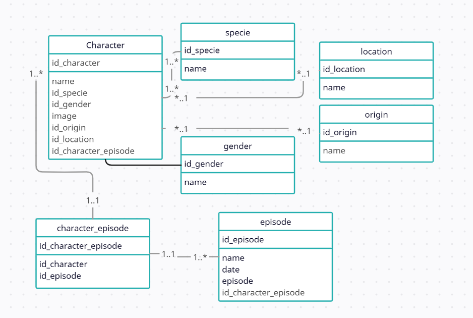

# Modelo Entidad relación - Rick and Morty

En el siguiente gráfico se evidencia el desarrollo de una base de datos entidad relación con respecto a la Información observada en la API de `Rick and Morty`.

## Entidades

**specie**: Contendrá los tipos de especie que existen que le pertenecerán a cada *character*. Como llave primaria se establece *id_specie*.

**location**: se establece una _clave primaria_ para identificar la locación, un _name_, esta tendrá una cardinalidad de N:1, en donde un lugar puede estar en muchos registros de la entidad _character_ y un registro de _character_ solo puede tener una referencia a una locación.

**origin**: Se establece una _clave primaria (PK)_ que va a identificar el origen con una cardinalidad de *(1:N)* con cada registro de la entidad _character_

**gender**: Va a contener una _clave primaria_ para identificar cada uno de los géneros. tendrá una cardinalidad *1:N*; un genero puede estar en muchos registros de la entidad _character_ pero un _character_ solo tendrá una relación con un registro de la entidad _gender_.

**episode**: Esta entidad no es auxiliar, si no que es una entidad totalmente independiente. Contiene la información de el _episodio_ con una _clave primaria_ para identificarlo. Esta tendrá una cardinalidad de _(N:N)_ con la entidad de _character_; Un _character_ puede estar relacionado con muchos registros de la entidad _episode_ y muchos _episode_ puede estar relacionado con muchos registros de la entidad _character_.

Para este tipo de cardinalidad es necesario contar con una tabla auxiliar para mantener los registros de cada relación.

**Character**:  
Ubicamos como llave primaria *id_character*, la cual va a identificar el registro, Como _llaves foraneas_ tenemos: *id_specie*, *id_gender*, *id_origin*, *id_location*, *id_character_episode*.

## Tablas auxiliares

**character_episode**: Es la tabla auxiliar que nos va a permitir mantener los registros de relación entre cada relación en la cardinalidad de _(N:N)_ que existe entre _character_ y _episode_.